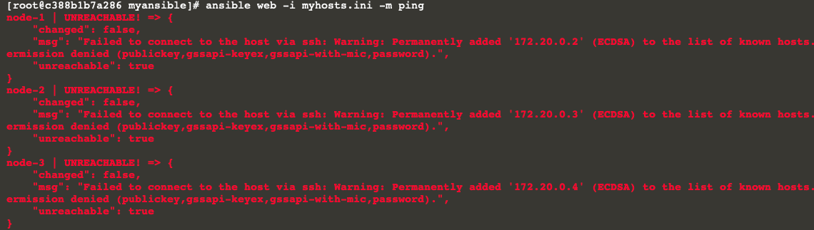

# Prepare Remote Connection: Create SSH Key on Ansible Host
---

Without preparing SSH key and distribute them to all target nodes (managed nodes), you migh get the following erros while running ansible command.

````
ansible web -i myhosts.ini -m ping
```{{execute}}



In order to avoid this issue and to be able to connect from the Ansible controlled node to the target node (managed node), we need to create a private + public SSH key pair on Ansible and copy the public key to all target nodes.

On the ansible controlled node, let us generate a SSH key pair like follows:

`ssh-keygen -t rsa`{{execute}}

Just keep the defaults, click into the Terminal and press Enter three times.

This will generate `~/.ssh/id_rsa.pub` and `~/.ssh/id_rsa` on the `~/.ssh directory:`

`ls -ltr ~/.ssh`{{execute}}

Now, In order to inform the target about the ansible host's public SSH key, we need to copy this SSH to all target machine:

`ssh-copy-id centos@node-1`{{execute}}
`ssh-copy-id centos@node-2`{{execute}}
`ssh-copy-id centos@node-3`{{execute}}

>__Note__: When password prompt appears, enter `centos` as the password for user `centos`


Now, since the target knows about the Ansible host's public SSH key, we are ready to connect from the Ansible host to our target:

Now we test the connection, that had failed previously:

`ansible web -i myhosts.ini -m ping`{{execute}}

