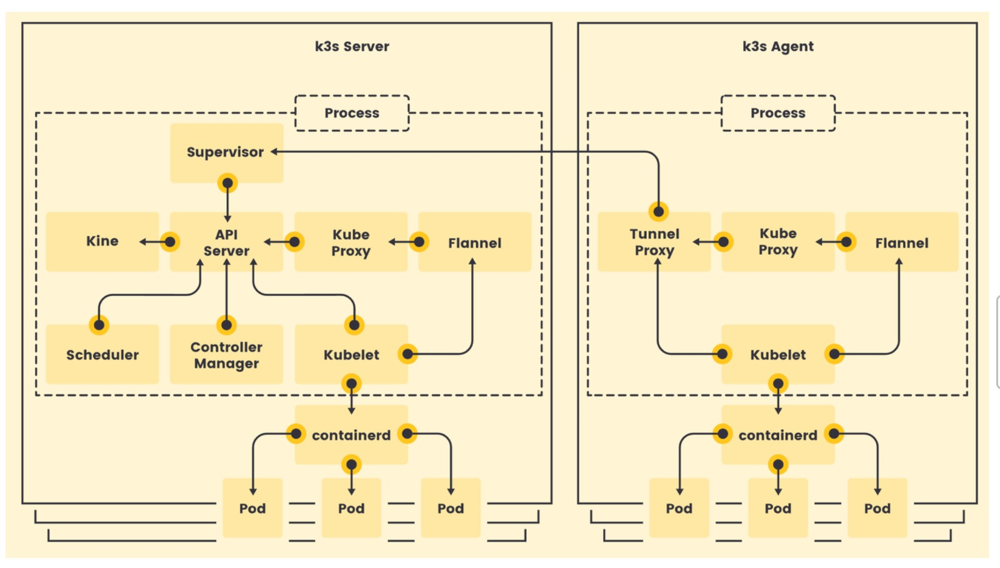

## Fundamental K3s -- Lightweight Kubernetes
In this lab, you will learn how to setup a Kubernetes cluster using K3s.

Rancher has introduced K3s, a specific variant of Kubernetes meticulously crafted for lightweight performance on hardware with limited resources and minimal services. It offers simple installation, swift configuration, and operates with a small memory footprint, all within a binary file that is under 55 megabytes in size."

In this lab, you will learn how to:

- [x] Install K3s on Linux
- [x] Use K3s just like other Kubernetes clusters
- [x] Access a Kubernetes Dashboard
- [x] Add worker nodes to a K3s cluster

K3s is a certified Kubernetes distribution and a Cloud Native Computing Foundation sandbox project.

K3s is a streamlined distribution of Kubernetes. In the realm of Kubernetes, a distribution, distinct from how we typically view Linux distributions, serves as a means to quickly deploy and operate Kubernetes. These distributions offer a preconfigured version of Kubernetes along with tools for its installation and management.  
* Let’s take a look at the K3s architecture. K3s supports two processes, **the server** and **the agent**. They can run separately, but by default, K3s runs one process that includes both.
* The simplest way to deploy K3s is as a single node cluster, which runs one server with the embedded agent enabled. 
* This sandbox outlines the installation procedure for setting up a single-node Kubernetes cluster using K3s, a lightweight solution that is perfect for small-scale use cases and quick development.  

**HAVE FUN!!**